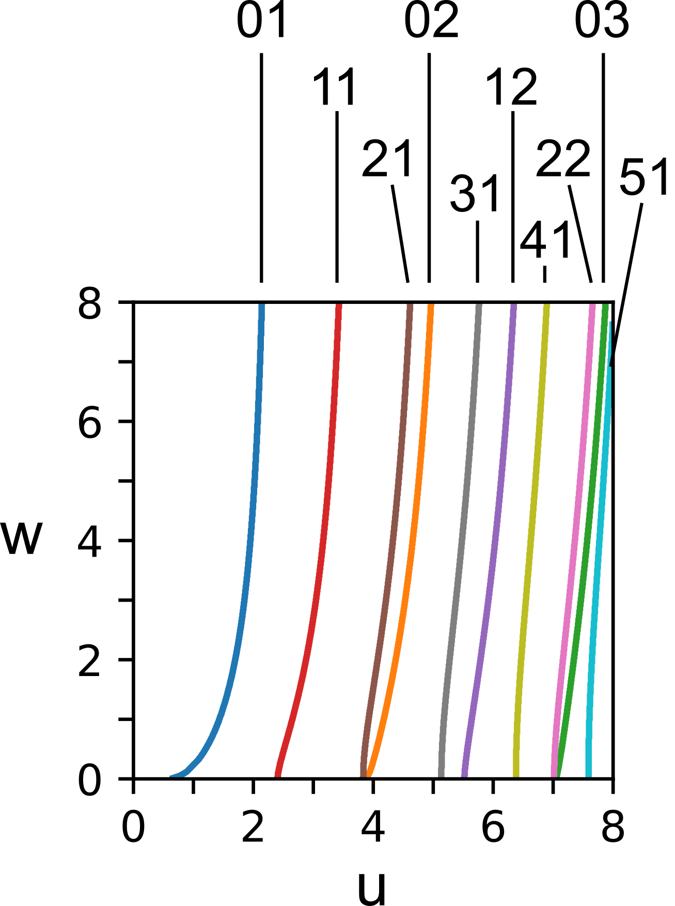

# liblp.py

rev 1 - 27.04.2015


# overview

This small toolkit allows to calculate the transverse fiber modes guided in a simple step-index fiber.
Such a fiber is characterized by the _normalized frequency_, V (V-number).


where \lambda_0 is the wavelength, a the core radius and n_co and n_cl are the refractive indeces of the core and the cladding, respectively.

Valid (guided) fiber modes that can be determined by solving the differential equation 


where J_i and K_i are the _i_ - th Bessel functions, and _u_ and _w_ dimensionless, positive numbers fulfilling the condition


The branches of the first view modes in the u-v-Plane are shown in the picture below.



# using the toolkit

# 1. determining which modes are guided for a given V-number

Using the function **get\_intersects** from liblp, the intersection points of a circle of radius **V** with the mode branches in the u-w-plance can be calculated.

The function looks for branches and returns the intersection coordinates.

Example: for V=4.5, the modes LP01, LP02, LP11 and LP21 are guided.

```
from liblp import get_intersects

# set the V-number
V=4.5

# look for LP modes up to LP_mmax,x
mmax = 5  

for m in range(mmax+1):
    intersects = get_intersects(m, V)
    print("\nm=%d, # of intersections: %d\n"%(m, len(intersects)))
    for intersect in intersects:
        print("  %s u=%.3f w=%.3f"%(intersect[2], intersect[0], intersect[1]))
```
gives the output:

```
m=0, # of intersections: 2

  LP01 u=1.958 w=4.052
  LP02 u=4.266 w=1.434

m=1, # of intersections: 1

  LP11 u=3.085 w=3.276

m=2, # of intersections: 1

  LP21 u=4.064 w=1.932

m=3, # of intersections: 0
m=4, # of intersections: 0
m=5, # of intersections: 0
```
## 2. calculate the field of some modes

To calculate the field, we are using the parameter from above,   V=4.5.
The fields of the modes can be calculated using the function **besselmode** 
```
from liblp import besselmode
import numpy as np
from matplotlib import pyplot as plt # for plotting

# x-and y vector for the modes to be calculated
x = np.linspace(-2,2,500)   # in units of a
y = x 

# LP01 mode
m=0
u=1.958
w=4.052
m01 = besselmode(m, u, w, x, y)
plt.figure()
plt.imshow(m01, extent=(min(x), max(x), min(y), max(y)), clim=[-1,1], cmap='bwr')
plt.colorbar()

# LP02 mode
m=0
u=4.266 
w=1.434
m02 = besselmode(m, u, w, x, y)

plt.figure()
plt.imshow(m02, extent=(min(x), max(x), min(y), max(y)), clim=[-1,1], cmap='bwr')
plt.colorbar()

# LP11 mode
m=1
u=3.085
w=3.276

m11 = besselmode(m, u, w, x, y)

plt.figure()
plt.imshow(m11, extent=(min(x), max(x), min(y), max(y)), clim=[-1,1], cmap='bwr')
plt.colorbar()

# LP21 mode

m=2
u=4.064 
w=1.932

m21 = besselmode(m, u, w, x, y)
plt.figure()
plt.imshow(m21, extent=(min(x), max(x), min(y), max(y)), clim=[-1,1], cmap='bwr')
plt.colorbar()

```
## besselmode(m, u, w, x, y, phioff)

        calculate the (unscaled!) field of a bessel mode LP mode
        
        Args:
        - m azimuthal number of periods (m=0,1,2,3...)
        - u, w  radial phase constant and radial decay constant
        - x, y transverse coordinates
        - phioff: offset angle
    
## get_branches(m, V, pts=300)
        calculate the branches of LPmp, for given m
        
        Args:
        - m azimuthal number of periods (m=0,1,2,3...)
        - V  V-number, normalized frequency
    
## get\_intersects(m, V, epsilon=0.0001, anglepts=500, peakfindpts=20)
        calculate the intersects  of a circle of given V-number with the branches of LPmp, for given m
        
        can be used to determine pairs of u,w for the modes of a given V,m
        
        Args:
        - m azimuthal number of periods (m=0,1,2,3...)
        - V  V-number, normalized frequency
        - [optional]  epsilon=1e-4, anglepts=500, peakfindpts=20   parameters to determine whether an intersect is 'real'
    
## jkdiff(m, u, w)
        calculate the absolute difference between Jm(u)/Jm+1(u)-Km(w)/Km+1(w)
        useful to determine the branches of LP modes in a step-index fiber
        
        Args: 
        - m azimuthal number of periods (m=0,1,2,3...)
        - u radial phase constant
        - w radial decay constant
