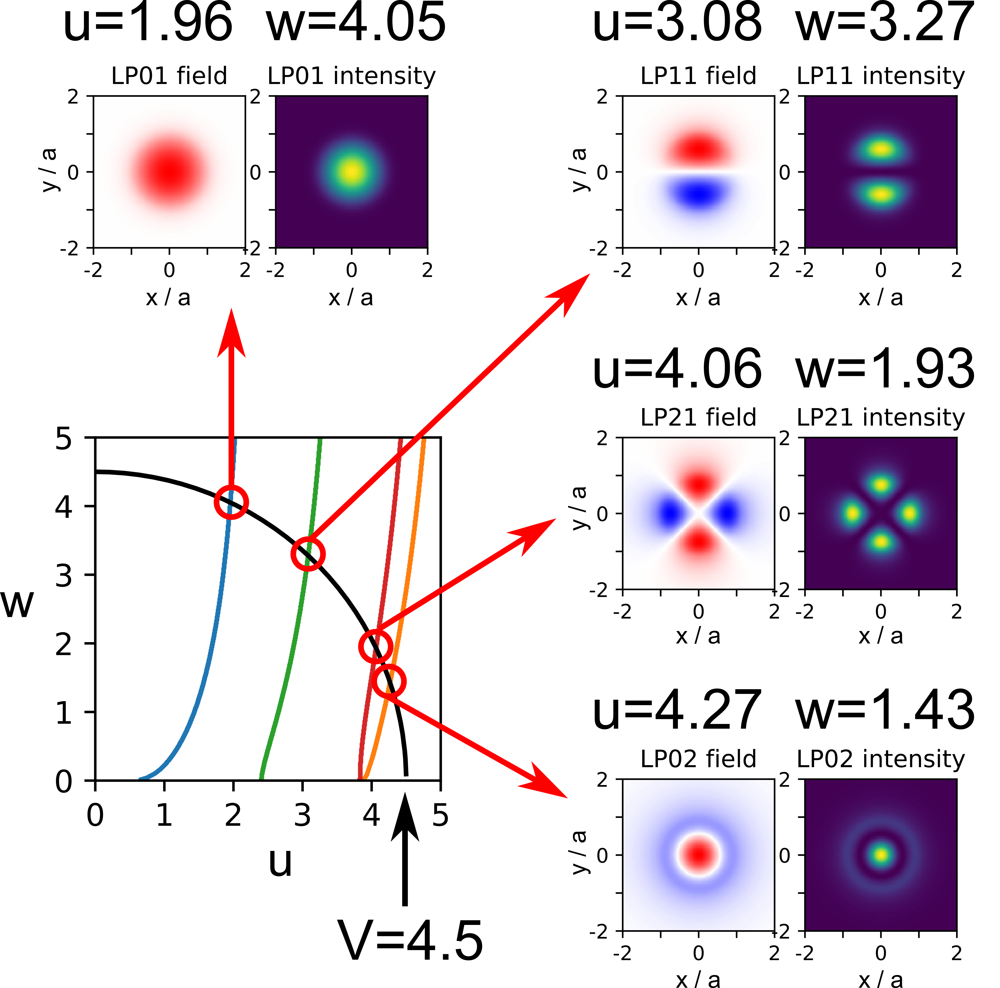

# liblp.py

rev 2 - 11.10.2018


# overview

This small toolkit allows to calculate the transverse fiber modes guided in a simple step-index fiber.
Such a fiber is characterized by the _normalized frequency_, V (V-number).


where \lambda_0 is the wavelength, a the core radius and n_co and n_cl are the refractive indeces of the core and the cladding, respectively.

Valid (guided) fiber modes that can be determined by solving the differential equation 


where J_i and K_i are the _i_ - th Bessel functions, and _u_ and _w_ dimensionless, positive numbers fulfilling the condition


The branches of the first view modes in the u-w-Plane are shown in the picture below.


# using the toolkit

# 1. determining which modes are guided for a given V-number

Using the function **get\_intersects** from liblp, the intersection points of a circle of radius **V** with the mode branches in the u-w-plance can be calculated.

The function looks for branches and returns the intersection coordinates.

Example: for V=4.5, the modes LP01, LP02, LP11 and LP21 are guided.

```
from liblp import get_intersects

# set the V-number
V=4.5

# look for LP modes up to LP_mmax,x
mmax = 5  

for m in range(mmax+1):
    intersects = get_intersects(m, V)
    print("\nm=%d, # of intersections: %d\n"%(m, len(intersects)))
    for intersect in intersects:
        print("  %s u=%.3f w=%.3f"%(intersect[2], intersect[0], intersect[1]))
```
gives the output:

```
m=0, # of intersections: 2

  LP01 u=1.958 w=4.052
  LP02 u=4.266 w=1.434

m=1, # of intersections: 1

  LP11 u=3.085 w=3.276

m=2, # of intersections: 1

  LP21 u=4.064 w=1.932

m=3, # of intersections: 0
m=4, # of intersections: 0
m=5, # of intersections: 0
```
## 2. calculate the field of some modes

We are using the parameter from above, V=4.5.
The fields of the modes can be calculated using the function **besselmode** 
```
from liblp import besselmode
import numpy as np
from matplotlib import pyplot as plt # for plotting

# x-and y vector for the modes to be calculated
x = np.linspace(-2,2,500)   # in units of a
y = x 

# LP01 mode
m=0
u=1.958
w=4.052
m01 = besselmode(m, u, w, x, y)
plt.figure()
plt.imshow(m01, extent=(min(x), max(x), min(y), max(y)), clim=[-1,1], cmap='bwr')
plt.colorbar()

# LP02 mode
m=0
u=4.266 
w=1.434
m02 = besselmode(m, u, w, x, y)

plt.figure()
plt.imshow(m02, extent=(min(x), max(x), min(y), max(y)), clim=[-1,1], cmap='bwr')
plt.colorbar()

# LP11 mode
m=1
u=3.085
w=3.276

m11 = besselmode(m, u, w, x, y)

plt.figure()
plt.imshow(m11, extent=(min(x), max(x), min(y), max(y)), clim=[-1,1], cmap='bwr')
plt.colorbar()

# LP21 mode

m=2
u=4.064 
w=1.932

m21 = besselmode(m, u, w, x, y)
plt.figure()
plt.imshow(m21, extent=(min(x), max(x), min(y), max(y)), clim=[-1,1], cmap='bwr')
plt.colorbar()

```

The picture below shows the intersections of a V=4.5 circle with the branches in the u-v plane, as well as the mode fields of the four guided modes.




# function reference:

## main functions:

### 1. get\_intersects(m, V, [anglepts=500, peakfindpts=5, maxjkdiff=1e-2])

```
Calculate the intersects of the V-circle with the branches of LPmp for given m

Arguments:
    - m azimuthal number of periods (m=0,1,2,3...)
    - V  V-number, normalized frequency

Optional arguments:
    - anglepts: number of points for the circle (default=500)
    - peakfindpts: intersection points are determined by searching
                   for peaks of 1/jkdiff along the V-circle.
                   For an u-w pair to be recognized as peak,
                   it must be a maximum in a surrounding of
                   peakfindpts points.
    - maxjkdiff: sets the maximum value for jkdiff, so that
                 an intersection is still recognized

Returns:
    - reslist: list of branch intersections found.
        consists of sub-lists [u, w, modename]
```

### 2. besselmode(m, u, w, x, y, [phioff=0])
```
Calculate the field of a bessel mode LP mode.

Arguments:
    - m azimuthal number of periods (m=0,1,2,3...)
    - u, w  radial phase constant and radial decay constant
    - x, y transverse coordinates
    - phioff: offset angle, allows to rotate the mode in
              the x-y plane          
          
Returns:
    - mode: calculated bessel mode 
```

## auxiliary functions

### 3. pyfindpeaks( environment, valuelist , thresh)
```
Determine peak positions in a list or array of real values.

Arguments:
  - environment: (INT) a maxima has to be the local maximum in this environment of points
  - valuelist: list or array of points to find the maxima in
  - thresh: a maximum has to be larger than this value

Returns:
  - listindices: positions of the peaks found
```

### 4. jkdiff(m,u,w)
```
Calculate the absolute difference diff = |Jm(u)/Jm+1(u)-Km(w)/Km+1(w)|.

Can be used to determine the branches of LP modes in a step-index fiber.

Arguments:
    - m azimuthal number of periods (m=0,1,2,3...)
    - u radial phase constant
    - w radial decay constant

Returns:
    - diff - Difference
```


### 5. calc\_jkdiff\_matrix(m, V, pts=300)
```
calculate the Difference
diff = |Jm(u)/Jm+1(u)-Km(w)/Km+1(w)|
for a given m for a matrix
[0..V] x [0..V] with pts x pts values.

Arguments:
    - m: azimuthal number of periods (m=0,1,2,3...)
    - V:  V-number, normalized frequency

Optional Arguments:
    - pts: number of grid points for each of the two
           axes of the matrix

Returns:
    - jkdiffmatrix
    - uv : u vector (=w vector)
```
